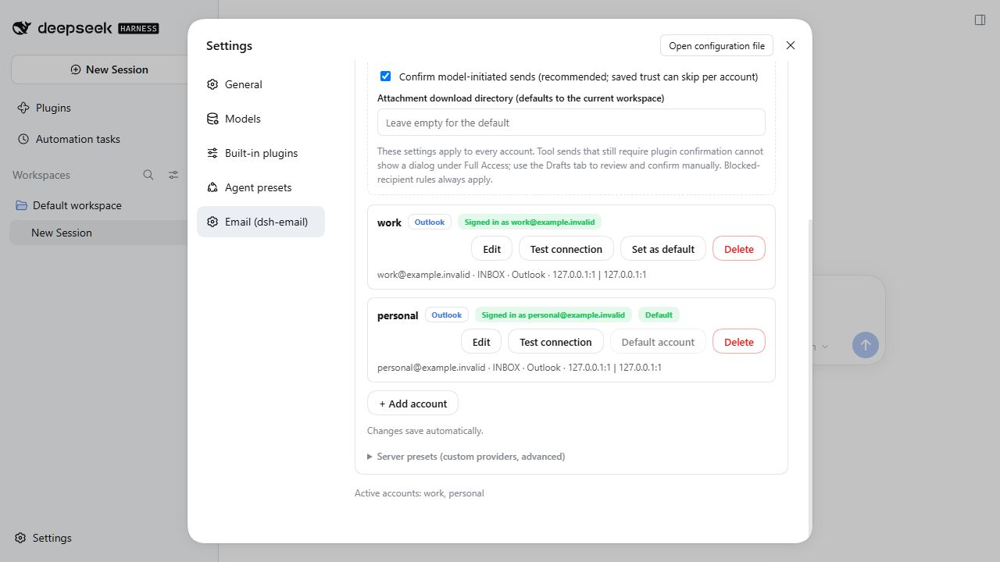
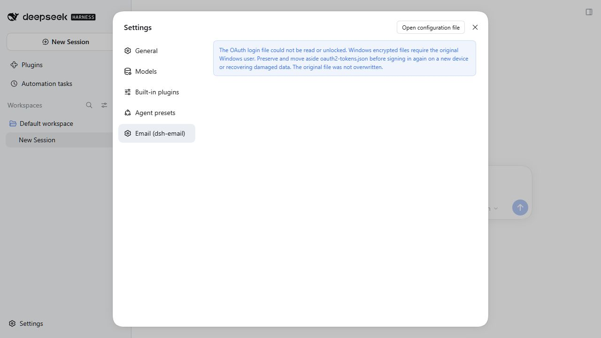

# 0.16.2 · Windows OAuth2 令牌保护

2026-10-08，Windows / Node 24.16.0。PR #22 提到了明文令牌存储问题，但 diff 仅向 `lib/oauth2.js` 增加未使用的加密函数导入，未改源码、读写或迁移；构建还会覆盖这行。此次修复在 TypeScript 源码实现。

## 实现与保护范围

- Windows 使用系统 PowerShell 调用 .NET `ProtectedData` / DPAPI，绑定 `CurrentUser`，加密整个有效令牌文档。静态脚本不携带凭据；输入输出通过匿名进程管道，隐藏窗口，超时 10 秒，输出有上限，不打印原始子进程异常。
- 新文件只包含版本、保护机制与密文，没有 access / refresh token 或账号明文。首次读取有效旧文件时先加密成功，再原位替换；不生成明文备份。缓存只复用字节完全相同的已认证文档，每次仍读取文件，不掩盖密文被修改。
- 私有临时文件写入、同步后再原子替换。加密不可用、未知格式、截断或解锁失败时不覆盖旧数据，不回退 Windows 明文写入。缺失文件仍表示未登录；格式损坏不再被错误地视为可覆盖的空账号集合。
- POSIX 仍为明文 JSON，更新通过 0600 新文件替换，从而修正旧文件过宽的权限。没有将文件权限描述为加密。

DPAPI 使用 Windows 登录身份提供保护，通常要求同一用户及机器；**同一用户运行的其他程序不在隔离范围内**。跨设备、换系统账号或退回旧插件格式时需要重新登录。与本机 `settings.yaml` 中密码账号授权码的保存方式无关，本次没有修改用户配置、密码或系统权限。

参考：[微软 ProtectedData](https://learn.microsoft.com/en-us/dotnet/api/system.security.cryptography.protecteddata?view=netframework-4.8)、[CryptProtectData](https://learn.microsoft.com/en-us/windows/desktop/api/Dpapi/nf-dpapi-cryptprotectdata)、[Node 文件权限 API](https://nodejs.org/api/fs.html#fschmodpath-mode-callback)。

## 验证

完整邮件回归 346 项通过；最终存储专项 6 项通过，包括真实 Windows DPAPI 加解密、独立 Node 进程解锁、旧数据迁移保留多账号、删除仅影响指定账号、未知格式 / 损坏 / 截断文件保留、缓存后篡改真实密文仍被拒绝、加密不可用时不生成明文或破坏旧文件。设备码、刷新单次请求、撤销登录、SMTP OAuth2 重试与取消等已有协议回归仍通过。

专项测试只使用 E 盘仓库下的隔离合成令牌，不读取本机账号令牌，不连接微软或实际邮箱，不泄露真实凭据。macOS / Linux 的原子保存与权限路径由 GitHub Linux CI 另行检查；Windows 专属原生用例在 Linux 明确跳过，不把模拟检查算作其他平台原生加密。

隔离官方 Alpha 网页在 1280×720 实际操作通过：首次加载后三个合成 Outlook 账号都保持已登录，磁盘已变为密文；在账号页删除 spare 并确认，剩下 work / personal 的令牌和登录状态不变。人为破坏保护机制标识后，英文设置页显示保留原文件和恢复操作的完整提示，文件 SHA256 没有被页面改写；恢复原密文，再切换回邮件页，两账号重新正常显示。正常页面控制台没有 error / warn；故障步骤产生的拒绝响应属于预期检查。

没有 API 密钥或真实凭据进入隔离环境，未调用测试连接或实际邮箱。真实微软账号授权、跨 Windows 用户解锁拒绝及原生 DSH 桌面操作不属于本次验收。
